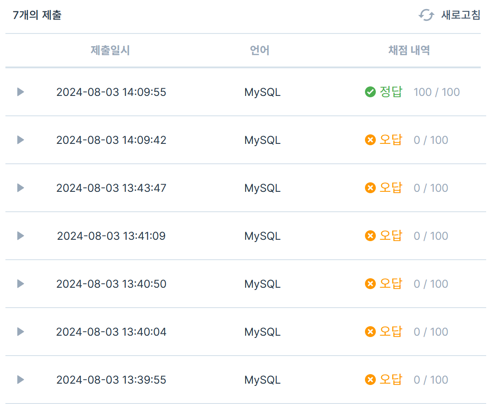

[가장 비싼 상품 구하기](https://school.programmers.co.kr/learn/courses/30/lessons/131697)

PRODUCT 테이블에서 판매 중인 상품 중 가장 높은 판매가를 출력하는 SQL문을 작성해주세요. 이때 컬럼명은 MAX_PRICE로 지정해주세요.

max 사용하면 될 거 같음

```sql
-- 코드를 입력하세요
-- PRODUCT 테이블에서 판매 중인 상품 중 가장 높은 판매가를 출력하는 SQL문을 작성해주세요.
-- 이때 컬럼명은 MAX_PRICE로 지정해주세요.
SELECT price as MAX_PRICE
from product
where price = (select max(price) from product)
```

서브쿼리 내에서 from product 붙이지 않아서 뭔가뭔가 이상한 값들 나왔음. 서브쿼리 내에서는 항상 일반?쿼리처럼 형식 맞춰줘야

---

[최댓값 구하기](https://school.programmers.co.kr/learn/courses/30/lessons/59415)

가장 최근에 들어온 동물은 언제 들어왔는지 조회하는 SQL 문을 작성해주세요.

131697랑 똑같이 하면 되는 거 아닌가

```sql
-- 코드를 입력하세요
-- 가장 최근에 들어온 동물은 언제 들어왔는지 조회하는 SQL 문을 작성해주세요.
SELECT datetime from animal_ins where datetime = (select max(datetime) from animal_ins)
```

어렵진 않은듯

---

[흉부외과 또는 일반외과 의사 목록 출력하기](https://school.programmers.co.kr/learn/courses/30/lessons/132203)

DOCTOR 테이블에서 진료과가 흉부외과(CS)이거나 일반외과(GS)인 의사의 이름, 의사ID, 진료과, 고용일자를 조회하는 SQL문을 작성해주세요. 이때 결과는 고용일자를 기준으로 내림차순 정렬하고, 고용일자가 같다면 이름을 기준으로 오름차순 정렬해주세요.

1. doctor 테이블에서 cs거나, gs인 의사 dr_name, dr_id, MCDP_CD, HIRE_YMD를 조회하는 sql문
2. 고용일자 기준으로 내림차순, 고용일자가 같다면, 이름을 기준으로 오름차순
3. 2020-03-01와 같은 날짜 형식을 해야.. (기존: 2010-07-01 00:00:00)

2는 `order by hire_ymd desc dr_name` 하면 바로 될 거 같은데 1은 바로 생각이 안나네..

```sql
-- 코드를 입력하세요
-- 1. doctor 테이블에서 cs거나, gs인 의사 dr_name, dr_id, MCDP_CD, HIRE_YMD를 조회하는 sql문
-- 2. 고용일자 기준으로 내림차순, 고용일자가 같다면, 이름을 기준으로 오름차순

SELECT dr_name, dr_id, mcdp_cd, date_format(hire_ymd, '%Y-%m-%d') as hire_ymd FROM doctor WHERE mcdp_cd LIKE 'CS' OR mcdp_cd LIKE 'GS' ORDER BY hire_ymd DESC, dr_name;

```

`where mcdp_cd like "CS" or "GS"`가 아닌, `where mcdp_cd like "CS" or mcdp_cd like "GS"`와 같은 방식으로 해야 함.

date형식일 때, 날짜만 얻고 싶다면 date_format(v1, '%y-%m-%d')함수 사용

---

[재구매가 일어난 상품과 회원 리스트 구하기](https://school.programmers.co.kr/learn/courses/30/lessons/131536)

ONLINE_SALE 테이블에서 동일한 회원이 동일한 상품을 재구매한 데이터를 구하여, 재구매한 회원 ID와 재구매한 상품 ID를 출력하는 SQL문을 작성해주세요. 결과는 회원 ID를 기준으로 오름차순 정렬해주시고 회원 ID가 같다면 상품 ID를 기준으로 내림차순 정렬해주세요.

ONLINE_SALE 테이블에서 한 회원이 같은 이름의 상품 2개 이상 구매했다면, USER_ID와 PRODUCT_ID를 --

```sql
select user_id, product_id from online_sale
group by user_id, product_id
having count(*) > 1
order by user_id, product_id desc;
```

user_id, product_id에서동일한 값을 가진 행들을 묶고, having count()로 조건 맞춰서 -

---

[오랜 기간 보호한 동물1](https://school.programmers.co.kr/learn/courses/30/lessons/59044)

animal_outs : 입양 보낸 동물의 정보 테이블
animal_id: animal_ins의 animal_id의 외래키
animal_type
datetime
name
sex_upon_outcome

animal_ins 테이블
animal_id
animal_type
...

실행 결과
| name | datetime |
| a | b |

입양 못 간 동물 중, 가장 오래 보호소에 있던 동물 3마리의 이름과 보호 시작일 조회
보호 시작일 순으로 조회

outer join써서 animal_ins에는 있지만, animal_outs에 없는 친구들 가져오기
어떠한 방식?을 써서 3개만 뽑고
보호 시작일 순으로 정렬

```sql

select *
from animal_outs
right outer join animal_ins
on animal_ins.animal_id = animal_outs.animal_id
where animal_outs.animal_id = (select null from animal_outs)

# where animal_outs의 animal_id가 null인
```

음.. **여기서 animal_outs.animal_id가 null인..**을 어떻게

-> 그냥 `where animal_outs.animal_id is null`하면 되겠구나

```sql

select animal_ins.name, animal_ins.datetime
from animal_outs
right outer join animal_ins
on animal_ins.animal_id = animal_outs.animal_id
where animal_outs.animal_id is null
order by animal_ins.datetime desc
limit 3;
```

limit n 하는 방식으로 되는구나

---

(카테고리 별 도서 판매량 집계하기)[https://school.programmers.co.kr/learn/courses/30/lessons/144855]

book table

    - BOOK_ID
    - CATEGORY
    - AUTHOR_ID
    - PRICE
    - PUBLISHED_DATE

book_sales table

    - BOOK_ID
    - SALES_DATE
    - SALES

1. 2022년 1월의 카테고리 별 도서 판매량을 합산하고
2. 카테고리(CATEGORY), 총 판매량(TOTAL_SALES) 리스트를 출력
3. 카테고리명을 기준으로 오름차순

-> 해당 카테고리의 책이 몇 권 팔렸는지 출력

우선 book id를 기준으로 inner join하고,

카테고리랑 총 판매량을그룹 후 count()해서 세면 될듯

```sql
select category, count(sales) as total_sales
from book
inner join book_sales on book.book_id = book_sales.book_id
group by category;
```

왜 안되지 했는데 2022년 1월의 카테고리 별 도서 판매량만 따로 봐야했었네

아 publish day가 아니라 팔린 날을 봐야하지..😥

[▶ COUNT/SUM: COUNT(행의 개수 구하기), SUM(행 데이터의 합계 구하기)](https://m.blog.naver.com/sqlgate/221374572243) 보면 count가 아니라 sum을 해야하는 것을 알 수 있음

```sql
select category, sum(sales) as total_salse
from book
inner join book_sales on book.book_id = book_sales.book_id
where book_sales.sales_date between '2022-01-01' and '2022-01-31'
group by category
order by category
```



휴..

- 정리
  - book table, book_sales table이 있을 때 → `from book inner join book_sales on book.book_id = book_sales.book_id`
  - 2022년 1월의 카테고리 별 도서 판매량 합산 → `where 판매일 between '2022-01-01' and '2022-01-01'`
  - 카테고리, 해당 카테고리의 총 판매량 리스트를 출력 → `select category, sum(sales) group by category`
  - 카테고리명을 기준으로 오름차순 → `order by category`

---

[조건에 맞는 사용자와 총 거래금액 조회하기](https://school.programmers.co.kr/learn/courses/30/lessons/164668)

USED_GOODS_BOARD와 USED_GOODS_USER 테이블에서 완료된 중고 거래의 총금액이 70만 원 이상인 사람의 회원 ID, 닉네임, 총거래금액을 조회하는 SQL문을 작성해주세요. 결과는 총거래금액을 기준으로 오름차순 정렬해주세요.

- used_goods_board table
- used_goods_user table

1. 완료된 중고 거래의 총 금액이 70만원 이상의 id, 닉네임, 총 거래금액 조회

2. 총거래금액 기준 오름차순

```sql
select user_id, nickname, sum(price) as total_sales
from used_goods_board
inner join used_goods_user on used_goods_board.writer_id = used_goods_user.user_id
group by used_goods_user.user_id, used_goods_user.nickname
having sum(price) >= 700000
order by sum(price)
```

왜 안되는 거지..
