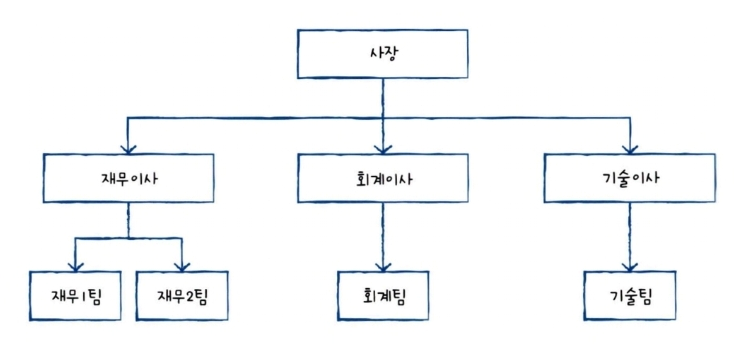

# Ch 01. 데이터베이스와 SQL

2주차 240703~ 240709

# Database & DBMS

`DBMS(Database Management System)`

- Database을 관리하고 운영하는 소프트웨어

- 단순히 저장하는 것을 넘어 여러 명의 사용자나 응용 프로그램에서 공유되고 동시에 접근이 가능해야 한다.

- 대량의 데이터를 효율적으로 관리하고 운영하기 위해 에드거 프랭크 커드가 이론을 정립했다.

# DBMS의 분류

`계층형 DBMS`

`망형 DBMS`

`관계형 DBMS (RDBMS)`

- table로 구성

- table은 col과 row로 이루어짐

# SQL (Sturucted Query Language)

관계형 데이터베이스에서 사용되는 언어

데이터베이스를 구축, 관리하고 활용하기 위해 사용되는 언어
