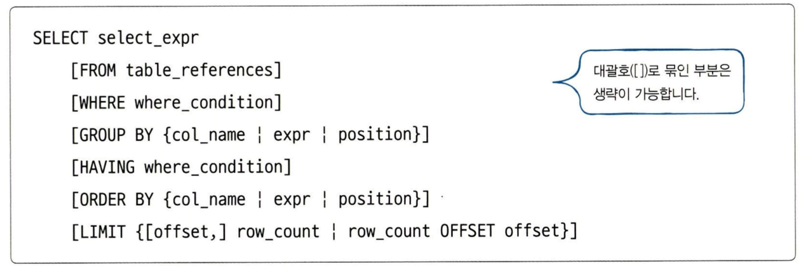

# Ch 03. SQL 기본 문법

# 03-1. SELECT ~ FROM~ WHERE

```sql
SELECT ~ FROM ~ WHERE
```

## 실습용 데이터베이스 구축

**데이터베이스 생성**

`DROP DATABASE` 기존 데이터 베이스 삭제

`CREATE DATABASE` 데이터 베이스 생성

```sql
DROP DATABASE IF EXISTS market_db; -- 만약 market_db가 존재하면 우선 삭제한다.
CREATE DATABASE market_db;
```

**회원 테이블(member), 구매 테이블(buy) 만들기**

`AUTO_INCREMENT` 자동 숫자 입력 

```sql
USE market_db;
CREATE TABLE member -- 회원 테이블
( mem_id  		CHAR(8) NOT NULL PRIMARY KEY, -- 사용자 아이디(PK)
  mem_name    	VARCHAR(10) NOT NULL, -- 이름
  mem_number    INT NOT NULL,  -- 인원수
  addr	  		CHAR(2) NOT NULL, -- 지역(경기,서울,경남 식으로 2글자만입력)
  phone1		CHAR(3), -- 연락처의 국번(02, 031, 055 등)
  phone2		CHAR(8), -- 연락처의 나머지 전화번호(하이픈제외)
  height    	SMALLINT,  -- 평균 키
  debut_date	DATE  -- 데뷔 일자
)DEFAULT CHARSET=utf8;

CREATE TABLE buy -- 구매 테이블
(  num 		INT AUTO_INCREMENT NOT NULL PRIMARY KEY, -- 순번(PK)
   mem_id  	CHAR(8) NOT NULL, -- 아이디(FK)
   prod_name 	CHAR(6) NOT NULL, --  제품이름
   group_name 	CHAR(4)  , -- 분류
   price     	INT  NOT NULL, -- 가격
   amount    	SMALLINT  NOT NULL, -- 수량
   FOREIGN KEY (mem_id) REFERENCES member(mem_id)
)DEFAULT CHARSET=utf8;
```

한글 인코딩 오류(1366) 때문에 `DEFAULT CHARSET=utf8;` 추가 해야 한다.

### 데이터 입력하기

`INSERT INTO tablename VALUES();` 데이터 입력

```sql
INSERT INTO member VALUES('TWC', '트와이스', 9, '서울', '02', '11111111', 167, '2015.10.19');
INSERT INTO buy VALUES(NULL, 'BLK', '지갑', NULL, 30, 2);
```

### 데이터 조회하기

```sql
SELECT * FROM member;
SELECT * FROM buy;
```

---

## 기본 조회하기 SELECT ~ FROM

### USE 문

`USE database_name;` 사용할 데이터베이스 지정

### SELECT문




`SELECT` 예약어

`*` member table의 모든 열을 선택 

`member` USE문으로 데이터베이스를 선택했기 때문에 `market_db.member` 형태에서 데이터베이스 이름을 생략해서 쓸 수 있다.

```sql
SELECT * FROM member;
```

`mem_name` 특정 열을 선택해 출력한다.

```sql
SELECT mem_name FROM member;
```

---

## 특정한 조건만 조회하기:  SELECT ~ FROM ~WHERE

### WHERE 절


```sql
SELECT mem_name FROM member WHERE mem_name = '블랙핑크';
```

```sql
SELECT mem_name FROM member WHERE mem_name = 4;
```

### 관계 연산자, 논리 연산자

숫자형 데이터에서 WHERE절에 **관계 연산자**를 입력하여 조회할 수 있다.

```sql
SELECT mem_id, mem_name FROM member WHERE height <= 162;
```


**논리 연산자** `AND` / `OR`를 사용해 여러 조건을 동시에 적용하여 조회할 수 있다.

```sql
SELECT mem_id, height, mem_name FROM member WHERE height >= 165 AND mem_number > 6;
```


```sql
SELECT mem_id, height, mem_name FROM member WHERE height >= 165 OR mem_number > 6;
```


### BETWEEN ~ AND

숫자형 데이터에서 범위 조회

```sql
SELECT mem_id, height, mem_name FROM member WHERE height >= 163 AND height <= 165;
```

```sql
SELECT mem_id, height, mem_name FROM member WHERE height BETWEEN 163 AND 165;
```

위와 같이 `BETWEEN ~ AND문`을 사용해 조회할 수 있다. 

### IN()

문자형 데이터에서 조회 

```sql
SELECT mem_name, addr FROM member WHERE addr IN('경기', '전남', '경남');
```


### LIKE

문자열의 일부 글자를 조회

`%` 어떤 문자든 허용

`_` 어떤 문자든 한 번 와야 함

```sql
SELECT * FROM member WHERE mem_name LIKE '우%';
SELECT * FROM member WHERE mem_name LIKE '__핑크';
```


---

### 서브 쿼리

SELECT 안에 또 다른 SELECT가 들어가는 경우

```sql
SELECT mem_name, height FROM member
	WHERE height > (SELECT height FROM member WHERE mem_name = '에이핑크');
```

---

# 03-2. ORDER BY, LIMIT, DISTINCT, GROUP BY, HAVING

## ORDER BY 절

결과가 출력되는 순서를 조절한다.


`ASC(Ascending)` 오름차순(기본값)

`DESC(Descending)` 내림차순

```sql
SELECT mem_id, mem_name, debut_date
	FROM member
	ORDER BY debut_date; -- 데뷔 일자가 빠른 순으로 정렬된다.
```

`DESC` : 역순으로 정렬하기

```sql
SELECT mem_id, mem_name, debut_date
	FROM member
	ORDER BY debut_date DESC; -- 데뷔 일자가 느린 순으로 정렬된다. 기본값 ACS
```

여러 열에 대해 정렬하기

```sql
SELECT mem_id, mem_name, debut_date     
	FROM member                          
	WHERE height >= 164                  
	ORDER BY height DESC, debut_date ASC;
```

`LIMIT` : 출력 행의 개수를 제한하기

`LIMIT 시작, 개수`

```sql
SELECT mem_id, mem_name, debut_date
	FROM member
	LIMIT 3; -- LIMIT 0, 3과 동일한 의미
```

### DISTINCT

조회된 결과 중 중복된 결과를 1개만 남기고 모두 제거한다.

```sql
SELECT DISTINCT addr FROM member;
```

## GROUP BY 절


### 집계 함수


```sql
SELECT mem_id, SUM(amount) FROM buy GROUP BY mem_id;

SELECT mem_id "회원 아이디", SUM(amount) "총 구매 개수" FROM buy GROUP BY mem_id; -- 별칭 활용
```

line 2에서는 별칭(alias)를 활용해 작성했다.

### Having 절

집계 함수에 대해 조건을 제한한다. 따라서, GROUP BY 절 뒤에 위치한다.

```sql
SELECT mem_id "회원 아이디", SUM(price*amount) "총 구매 금액"
	FROM buy
	GROUP BY mem_id
	HAVING SUM(price*amount) > 1000;
```

---

# 03-3. INSERT, AUTO_INCREMENT, UPDATE, DELETE

## INSERT

데이터 입력

`INSERT INTO table_name [(열1, 열2, …)] VALUES (값1, 값2, …)`

table_name 다음에 오는 열은 생략이 가능하며, 생략할 경우 값의 개수가 열의 개수와 동일해야 한다.

값이 입력되지 않은 열에는 NULL 값이 들어간다.

### AUTO_INCREMENT

AUTO_INCREMENT로 지정하는 열은 PRIMARY KEY로 지정해야 한다.

```sql
CREATE TABLE hongong2 (
	toy_id INT AUTO_INCREMENT PRIMARY KEY,
	toy_name CHAR(4),
	age INT)DEFAULT CHARSET=utf8;
```

AUTO_INCREMENT로 입력되는 시작 값을 변경하려면 아래 코드와 같이 입력하면 된다.

```sql
ALTER TABLE hongong2 AUTO_INCREMENT=100;
INSERT INTO hongong2 VALUES (NULL, '보핍', 25);
INSERT INTO hongong2 VALUES (NULL, '슬링키', 22);
INSERT INTO hongong2 VALUES (NULL, '렉스', 21);
```

n씩 자동 증가 시키고 싶을 때에는 시스템 변수인 `@@auto_increment_increment`를 변경시켜야 한다.

```sql
CREATE TABLE hongong2 (
	toy_id INT AUTO_INCREMENT PRIMARY KEY,
	toy_name CHAR(4),
	age INT)DEFAULT CHARSET=utf8;
ALTER TABLE hongong2 AUTO_INCREMENT=100; -- 시작 값을 1000으로 지정
SET @@auto_increment_increment=3; -- 증가 값을 3으로 지정
```

### INSERT INTO ~ SELECT

다른 테이블의 값을 한 번에 가져와서 입력하기

`INSERT INTO table_name (열_이름1, 열_이름2, …)`

`SELECT 문;`

SELECT 문의 열의 개수와 테이블의 열의 개수가 동일해야 한다.

## UPDATE

데이터 수정

### UPDATE 문의 기본 문법


WHERE 절은 생략 가능하나, 모든 행의 열에 대해 값을 변경하게 되므로 권장하지 않는 방법이다.

```sql
UPDATE city_popul
	SET population = population / 10000;
SELECT *FROM city_popul LIMIT 5;
```

## DELETE

행 단위로 데이터를 삭제


