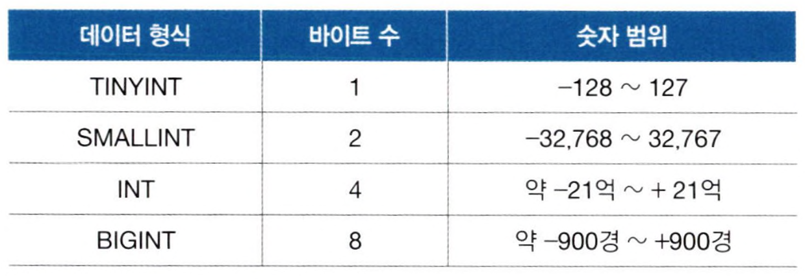

# Ch 04. SQL 고급 문법

# 04-1. mySQL의 데이터 형식

## 데이터 형식

표현하고자 하는 데이터의 범위에 맞게 데이터 형식을 설정해야 한다.

### 정수형



`UNSIGNED` 값의 범위가 0부터 시작된다.

숫자형으로 저장해야 하는 경우

- 연산에 의미가 있는 경우
- 수의 비교 혹은 순서에 의미가 있는 경우

### 문자형


`VARCHAR` 가변길이 문자형. 3자리만 저장할 경우 3자리만 사용한다.

### 대량의 데이터 형식

열의 길이를 너무 크게 설정하면 Column length too big 오류가 발생하는데, 이를 피해 데이터를 저장하기 위해서는 아래와 같은 형식을 사용한다.


`BLOB(Binary Long Object)` 글자가 아닌 이미지, 영상 등 이진 데이터 저장

### 실수형


### 날짜형


## 변수의 사용

변수의 선언

```sql
SET @변수이름 = 변수의 값;
SELECT @변수이름; --변수 값 출력
```

`WHERE` 절에서 조건을 지정할 때 변수를 사용할 수 있다.

`LIMIT` 절에서 출력할 행 수를 지정할 때에는 변수를 사용할 수 없다.

이를 해결하기 위해 `PREPARE`과 `EXECUTE`를 사용한다.

```sql
SET @count = 3;
PREPARE mySQL FROM 'SELECT mem_name, height FROM member ORDER BY height LIMIT ?';
EXECUTE mySQL USING @count;
```

## 데이터 형 변환

### 함수를 이용한 명시적인 변환

`CAST()`, `CONVERT()`

```sql
CAST(값 AS 데이터_형식 [ (길이) ])
CONVERT(값, 데이터_형식 [ (길이) ])
```

`CONCAT()` 문자열을 이어주는 기능

### 암시적인 변환

```sql
SELECT 100 + '200'; -- 암시적으로 변환되어 계산되므로 300으로 출력
```

# 04-2. JOIN

## 내부 JOIN

### 일대다(one to many) 관계

두 table의 JOIN을 위해서는 기본 키-외래 키 관계로 맺어져야 한다.

### 내부 JOIN의 기본


INNER JOIN에서 INNER를 생략해도 됨

`WHERE buy.mem_id = 'BLK';` mem_id인 ‘BLK’을 추출

`ON buy.mem_id = member.mem_id` ‘GRL’과 동일한 값을 mem_id에서 검색

`INNER JOIN member` 조건을 만족하는 행을 찾으면 두 행을 JOIN

```sql
USE market_db;
	SELECT * FROM buy
	INNER JOIN member
	ON buy.mem_id = member.mem_id
WHERE buy.mem_id = 'BLK';
```

### 내부 JOIN의 간결한 표현

```sql
SELECT buy.mem_id, mem_name, prod_name, addr, CONCAT(phone1, phone2) '연락처'
	FROM buy
		INNER JOIN member
		ON buy.mem_id = member.mem_id;
```

위 코드에서 FROM 절에 나오는 테이블의 이름 뒤에 **별칭 alias**를 주어 아래와 같이 간결하게 표현할 수 있다.

```sql
SELECT B.mem_id, M.mem_name, B.prod_name, M.addr, CONCAT(M.phone1, M.phone2) '연락처'
	FROM buy B
		INNER JOIN member M
		ON B.mem_id = M.mem_id;
```

## 외부 JOIN

두 테이블 중 한 쪽에만 데이터가 있어도 결과가 출력된다.


`LEFT OUTER JOIN buy B` 왼쪽 테이블(member)의 내용은 모두 출력되어야 한다.

`FULL OUTER JOIN` 한 쪽에 들어있는 내용이라면 모두 출력한다.

```sql
SELECT B.mem_id, M.mem_name, B.prod_name, M.addr
	FROM member M
		LEFT OUTER JOIN buy B
		ON B.mem_id = M.mem_id
	ORDER BY M.mem_id;
```

```sql
SELECT B.mem_id, M.mem_name, B.prod_name, M.addr
	FROM buy B
		RIGHT OUTER JOIN member M
		ON B.mem_id = M.mem_id
	ORDER BY M.mem_id;
```

## 기타 JOIN

### CROSS JOIN 상호 조인

```sql
SELECT *
	FROM buy
		CROSS JOIN member;
```

상호 조인의 특징

- ON 구문을 사용할 수 없다.
- 랜덤으로 조인하기 때문에 결과의 내용은 의미가 없다.
- 테스트하기 위해 대용량의 데이터를 생성할 때 사용한다.


### SELF JOIN 자체 조인


# 04-3. SQL 프로그래밍

### Stored Procedure의 구조

```sql
DELIMITER $$ -- 종료 문자 변경
CREATE PROCEDURE stored_procedure_name()
BEGIN
	-- 여기에 SQL 프로그램 구현
END $$
DELIMITER ;

CALL stored_procedure_name();
```

처리되어야 할 SQL 문장이 두 문장 이상일 때, BEGIN ~ END로 묶어 처리해야 한다.

### IF 문


### CASE 문


### WHILE 문

`ITERATE` continue와 유사

`LEAVE` break와 유사


## 동적 SQL

그럼 제가 선배 맘에~ **SQL Injection Attack후루후루**~
